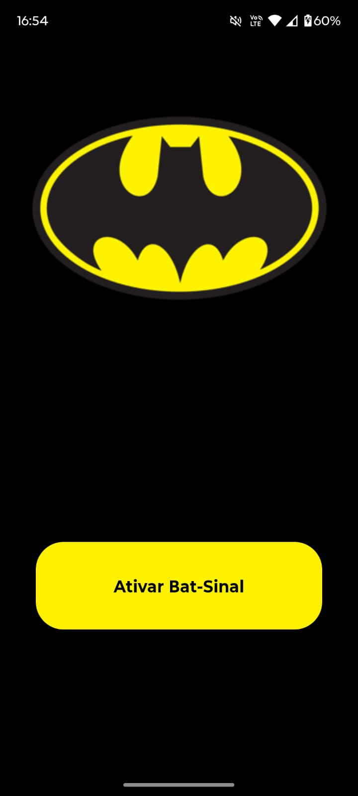
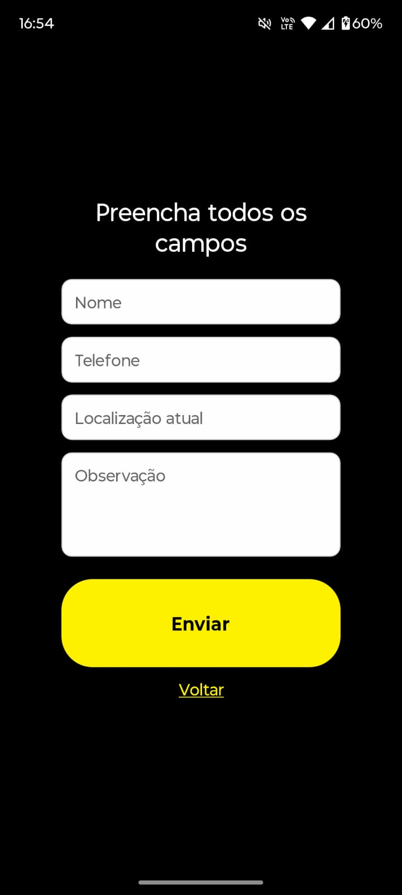

<div align="center">
  
</div>

# 🦇 Bat-Sinal App

Aplicativo desenvolvido em **React Native** para acionar e visualizar o famoso **Bat-Sinal** de forma interativa e responsiva.

Este projeto faz parte do **#DesafioDoFelipao - DIO**.

---

## 🚀 Funcionalidades
- Exibe a tela inicial com o **logo do Batman** e um botão.
- Ao clicar no botão, o logo desaparece e surge um **formulário**.
- O formulário coleta os seguintes dados:
  - Nome
  - Telefone para contato
  - Localização atual
  - Observação
- Ao enviar, simula o acionamento do Bat-Sinal.

---

## 📱 Capturas de Tela
| Tela Inicial | Formulário |
|--------------|------------|
|  |  |

---

## 🛠️ Tecnologias Utilizadas
- [React Native](https://reactnative.dev/)
- [Expo](https://expo.dev/)

---

## ▶️ Como Executar o Projeto
1. Clone este repositório:
   ```bash
   git clone https://github.com/Carloscb124/bat-sinal
Acesse a pasta do projeto:

bash
Copiar código
cd bat-sinal
Instale as dependências:

bash
Copiar código
npm install
Inicie o projeto:

bash
Copiar código
npx expo start
Escaneie o QR Code no seu celular com o Expo Go.

✨ Melhorias Futuras
Persistir os dados preenchidos no formulário.

Criar uma tela de confirmação personalizada.

Adicionar animações para o acionamento do Bat-Sinal.

